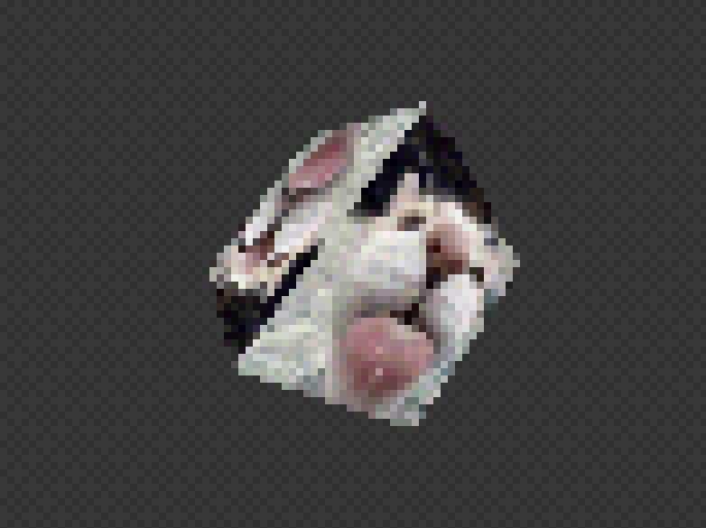

# kite
A small toy OpenGL wrapper for simple 3D/2D graphics written in C++.



Kite was written as a small introduction to the OpenGL framework and graphics rendering pipelines.

Hopefully in the future, this will be a framework for games or visualizations, which has keyboard and controller input, as well as a an audio engine.


## Compiling
Kite uses the following dependencies:
```
brew install glfw glew glm
```
When installed, compile and run the included example program with
```
make all
./kite
```

## Todo
* add input and audio api
* add support for .obj files
